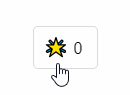

# @piyoppi/counter-tools

Simple counter tools for web pages.
You can set up a voting feature on your website.

## Setup

1. Deploy [@piyoppi/counter-api](./packages/counter)
1. Put button / count display using [@piyoppi/counter-button](./packages/counter-button)

## Packages

| Package | Description |
| --- | --- |
| [@piyoppi/counter-api](./packages/counter) | Counter api |
| [@piyoppi/counter-button](./packages/counter-button) | Counter button |
